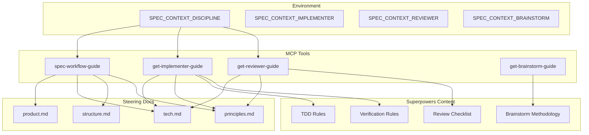

# Design Document: Discipline Workflow

## Overview

This feature adds development discipline enforcement to spec-context-mcp through three new MCP tools (`get-implementer-guide`, `get-reviewer-guide`, `get-brainstorm-guide`) and enhancements to the existing `spec-workflow-guide`. It also introduces a new `principles.md` steering document type and configurable discipline modes via environment variables.

## Steering Document Alignment

### Technical Standards (tech.md)
- New tools follow existing MCP tool patterns in `src/tools/workflow/`
- TypeScript with MCP SDK types (`Tool`, `ToolResponse`)
- Handlers return structured `ToolResponse` objects
- Reuse existing `getSteeringDocsContent()` pattern for loading steering docs

### Project Structure (structure.md)
- New tools in `src/tools/workflow/` alongside existing tools
- New template in `src/templates/principles-template.md`
- Environment variable handling in `src/server.ts`

## Code Reuse Analysis

### Existing Components to Leverage
- **`getSteeringDocsContent()`** in `spec-workflow-guide.ts`: Extend to include `principles.md`
- **`ToolResponse` type** in `workflow-types.ts`: Use for all new tool handlers
- **Template loading pattern**: Follow existing template file structure

### Integration Points
- **`spec-workflow-guide.ts`**: Add brainstorm option, discipline-aware content
- **`steering-guide.ts`**: Add `principles.md` to steering workflow
- **`src/templates/`**: Add `principles-template.md`
- **Environment variables**: Read from `process.env` in server initialization

## Architecture

### Modular Design Principles
- **Single File Responsibility**: Each guide tool in its own file
- **Component Isolation**: Guide content generators are pure functions
- **Service Layer Separation**: Tool definitions separate from handlers



## Components and Interfaces

### Component 1: get-implementer-guide Tool
- **Purpose:** Return discipline-specific implementation guidance
- **Interfaces:**
  ```typescript
  export const getImplementerGuideTool: Tool
  export async function getImplementerGuideHandler(args: any, context: ToolContext): Promise<ToolResponse>
  ```
- **Dependencies:** `workflow-types.ts`, steering doc loader
- **Reuses:** `getSteeringDocsContent()` pattern

### Component 2: get-reviewer-guide Tool
- **Purpose:** Return review criteria and project standards
- **Interfaces:**
  ```typescript
  export const getReviewerGuideTool: Tool
  export async function getReviewerGuideHandler(args: any, context: ToolContext): Promise<ToolResponse>
  ```
- **Dependencies:** `workflow-types.ts`, steering doc loader
- **Reuses:** `getSteeringDocsContent()` pattern

### Component 3: get-brainstorm-guide Tool
- **Purpose:** Return brainstorming methodology for pre-spec ideation
- **Interfaces:**
  ```typescript
  export const getBrainstormGuideTool: Tool
  export async function getBrainstormGuideHandler(args: any, context: ToolContext): Promise<ToolResponse>
  ```
- **Dependencies:** `workflow-types.ts`
- **Reuses:** None (internal use, no steering docs)

### Component 4: Discipline Configuration
- **Purpose:** Read and validate discipline mode from environment
- **Interfaces:**
  ```typescript
  type DisciplineMode = 'full' | 'standard' | 'minimal'
  function getDisciplineMode(): DisciplineMode
  function getDispatchCli(role: 'implementer' | 'reviewer' | 'brainstorm'): string | null
  ```
- **Dependencies:** `process.env`
- **Location:** `src/config/discipline.ts` or inline in server.ts

### Component 5: Steering Doc Loader (Shared Module)
- **Purpose:** Load specific steering docs on demand
- **Location:** `src/tools/workflow/steering-loader.ts` (extracted from spec-workflow-guide.ts)
- **Interfaces:**
  ```typescript
  type SteeringDocType = 'product' | 'tech' | 'structure' | 'principles';

  function getSteeringDocs(projectPath: string, docs: SteeringDocType[]): {
    [K in SteeringDocType]?: string;
  } | null
  ```
- **Dependencies:** `fs`, `path`
- **Rationale:** Each tool loads only what it needs:
  - spec-workflow-guide: `['product', 'tech', 'structure', 'principles']`
  - get-implementer-guide: `['tech', 'principles']`
  - get-reviewer-guide: `['tech', 'principles']`
  - get-brainstorm-guide: none (no steering docs)

## Data Models

### DisciplineConfig
```typescript
interface DisciplineConfig {
  mode: 'full' | 'standard' | 'minimal';
  implementerCli: string | null;
  reviewerCli: string | null;
  brainstormCli: string | null;
}
```

### GuideResponse
```typescript
interface GuideResponse extends ToolResponse {
  data: {
    guide: string;           // The methodology content
    steering?: {             // Auto-imported steering docs
      tech?: string;
      principles?: string;
    };
    disciplineMode: string;  // Current mode for reference
    searchGuidance?: string; // MCP search tool usage
  };
}
```

## Error Handling

### Error Scenarios
1. **Missing required steering docs**
   - **Handling:** Return error response with instructions to create via `steering-guide`
   - **User Impact:** Clear message: "Required steering doc 'principles.md' not found. Create it first using the steering-guide tool."

2. **Invalid discipline mode**
   - **Handling:** Log warning, default to `full`
   - **User Impact:** None (graceful default)

3. **Missing steering directory**
   - **Handling:** Return error for implementer/reviewer guides
   - **User Impact:** Clear message directing to steering creation

## Testing Strategy

### Unit Testing
- Test each guide returns correct content for each discipline mode
- Test steering doc loading with missing/present files
- Test environment variable parsing with valid/invalid values
- Test fail-fast behavior for missing required docs

### Integration Testing
- Test full workflow: spec-workflow-guide → brainstorm → implementer → reviewer
- Test discipline mode affects task generation
- Test steering doc content properly embedded in responses

### End-to-End Testing
- Test CLI dispatch invocation pattern
- Test review loop with issue detection
- Test orchestrator takeover on repeated issues

## File Changes

### New Files
- `src/tools/workflow/get-implementer-guide.ts`
- `src/tools/workflow/get-reviewer-guide.ts`
- `src/tools/workflow/get-brainstorm-guide.ts`
- `src/tools/workflow/steering-loader.ts` (extracted from spec-workflow-guide.ts)
- `src/templates/principles-template.md`
- `src/config/discipline.ts`

### Modified Files
- `src/tools/workflow/spec-workflow-guide.ts` - Add brainstorm option, discipline logic
- `src/tools/workflow/steering-guide.ts` - Add principles.md to workflow
- `src/tools/workflow/index.ts` - Export new tools
- `src/tools/index.ts` - Register new tools
- `src/server.ts` - Read discipline env vars
- `src/templates/tech-template.md` - Remove principles section (moved to principles.md)

## Guide Content Sources

Each guide's methodology content is adapted from Superpowers Skills:

| Guide | Source Skill | Key Content |
|-------|--------------|-------------|
| `get-implementer-guide` (full) | `test-driven-development` | Red-green-refactor, iron law, rationalizations |
| `get-implementer-guide` (all) | `verification-before-completion` | Gate function, evidence before claims |
| `get-implementer-guide` (all) | `receiving-code-review` | Feedback handling, push back guidance |
| `get-reviewer-guide` | `requesting-code-review` | Review checklist, severity levels |
| `get-brainstorm-guide` | `brainstorming` | Question-driven exploration, trade-offs |

Content is copied and adapted with:
- References to `principles.md` and `tech.md` steering docs
- MCP tool names and workflow
- `SPEC_CONTEXT_DISCIPLINE` mode logic
- LLM-agnostic language (no Claude-specific references)
