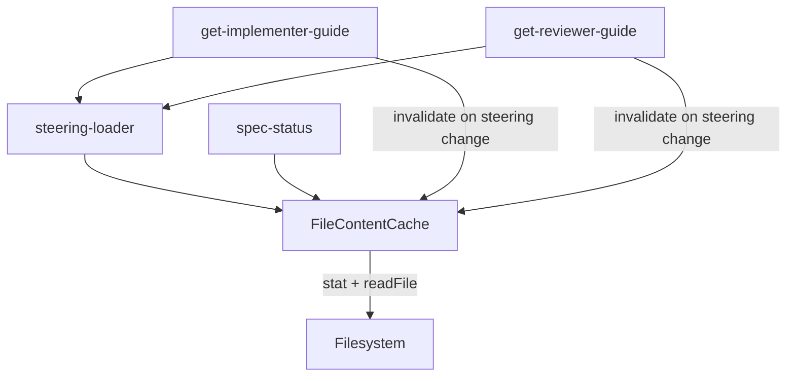

# Design Document: MCP Tool-Result Caching (Dimension 5 P1)

## Overview

Add a shared file-content cache that eliminates redundant disk reads across MCP tool handlers. The cache validates entries via mtime (fast) and content hash (authoritative), reusing the `SourceFingerprint` pattern from `dispatch-ledger.ts`. Three consumers integrate: steering-loader, spec-status, and guide tools.

## Current State

### Already Implemented
- `dispatch-ledger.ts`: `SourceFingerprint` (mtime + sha256 hash) with `isProgressLedgerStale()` — validates but does not cache
- `get-implementer-guide.ts`: per-run `Map<string, ImplementerGuideCacheEntry>` keyed on `runId` — no file-change invalidation
- `get-reviewer-guide.ts`: same pattern as implementer guide
- `steering-loader.ts`: `readFileSync` on every call, no caching

### Missing
- Shared file-content cache with mtime+hash invalidation
- Steering docs served from cache
- Spec-status parsed results served from cache
- Guide cache invalidation when steering docs change
- Cache hit/miss telemetry

## Design Goals

1. Single cache module reused by all consumers (DRY).
2. Consumers depend on interface, not concrete class (DIP).
3. Cache concerns separated from tool handler logic (SRP).
4. Mtime+hash double-check ensures no stale reads (correctness over speed).
5. Fallthrough to uncached read on any cache error (reliability).

## Code Reuse Analysis

### Existing Components to Leverage
- **`dispatch-ledger.ts` `SourceFingerprint`**: Reuse the mtime+hash validation pattern. Extract the shared concept into the cache module.
- **`steering-loader.ts` `getSteeringDocs`**: Modify to read through cache instead of `readFileSync`.
- **`SpecParser`**: Used by `spec-status.ts`. Cache wraps the parsed result, keyed on tasks.md fingerprint.

### Integration Points
- **`get-implementer-guide.ts`**: Existing `implementerGuideCache` gains steering-change invalidation by checking cache fingerprints.
- **`get-reviewer-guide.ts`**: Same as implementer.
- **`dispatch-ledger.ts`**: Can optionally consume the shared cache for `extractProgressLedger`, but this is a stretch goal — ledger already has its own staleness check.

## Architecture



## Components and Interfaces

### Component 1: FileContentCache

**New file:** `src/core/cache/file-content-cache.ts`

**Purpose:** In-memory cache for file contents, validated via mtime and content hash.

**Interface:**
```typescript
interface FileContentCacheEntry {
  content: string;
  mtimeMs: number;
  hash: string;
  cachedAt: number;
}

interface FileContentCacheTelemetry {
  hits: number;
  misses: number;
  errors: number;
}

interface IFileContentCache {
  get(filePath: string): Promise<string | null>;
  getFingerprint(filePath: string): { mtimeMs: number; hash: string } | null;
  getTelemetry(): FileContentCacheTelemetry;
  invalidate(filePath: string): void;
  clear(): void;
}
```

**Behavior:**
1. `get(filePath)`:
   - If no entry exists → `stat` + `readFile` + compute hash → store entry → return content (miss).
   - If entry exists → `stat` only → compare mtime.
     - Mtime matches → return cached content (hit).
     - Mtime differs → `readFile` + compute hash → update entry → return content (miss).
   - If file does not exist or stat fails → return `null` (miss, no error thrown).
2. `getFingerprint(filePath)`: Return cached mtime+hash without I/O (for invalidation checks by guide caches).
3. `invalidate(filePath)`: Remove single entry.
4. `clear()`: Remove all entries.

**Dependencies:** `fs.promises` (stat, readFile), `crypto` (createHash).
**No external dependencies.**

### Component 2: Steering Loader Cache Integration

**Modify:** `src/tools/workflow/steering-loader.ts`

**Changes:**
- Accept `IFileContentCache` parameter (dependency injection).
- Replace `readFileSync` calls with `cache.get()` (async).
- `getSteeringDocs` becomes async: `async getSteeringDocs(projectPath, docs, cache?)`.
- If no cache provided, fall through to direct `readFile` (backward compatible).
- `getMissingSteeringDocs` remains synchronous (only checks `existsSync`, no content needed).

### Component 3: Spec-Status Cache Integration

**Modify:** `src/tools/workflow/spec-status.ts`

**Changes:**
- Cache the `SpecParser.getSpec()` result keyed on `{projectPath}:{specName}`.
- Before parsing, check if tasks.md fingerprint (via `cache.getFingerprint`) matches cached entry.
- If match → return cached parsed result.
- If mismatch or no cache → parse fresh, store result with fingerprint.

**Cache entry shape:**
```typescript
interface SpecStatusCacheEntry {
  result: SpecData;
  tasksFingerprint: { mtimeMs: number; hash: string } | null;
}
```

This is a separate `Map` inside the spec-status module (not the `FileContentCache` itself, since the cached value is a parsed object, not raw file content). But it uses `FileContentCache.getFingerprint()` to check staleness.

### Component 4: Guide Cache Invalidation

**Modify:** `src/tools/workflow/get-implementer-guide.ts`, `src/tools/workflow/get-reviewer-guide.ts`

**Changes:**
- On compact mode cache hit, check if steering doc fingerprints have changed since guide was cached.
- Store steering fingerprints alongside guide cache entry:
  ```typescript
  interface ImplementerGuideCacheEntry {
    guide: string;
    disciplineMode: 'full' | 'standard' | 'minimal';
    steering: Record<string, string>;
    steeringFingerprints: Record<string, { mtimeMs: number; hash: string }>;
    cachedAt: string;
  }
  ```
- On compact lookup: compare stored fingerprints against `cache.getFingerprint()` for each steering doc.
- If any fingerprint differs → invalidate guide entry, force full reload.

## Data Flow

### Cache Hit Path (steering doc)
```
guide handler → steering-loader.getSteeringDocs()
  → cache.get("/.../steering/tech.md")
    → stat() → mtime matches → return cached content
  ← content (no readFile)
```

### Cache Miss Path (steering doc changed)
```
guide handler → steering-loader.getSteeringDocs()
  → cache.get("/.../steering/tech.md")
    → stat() → mtime differs → readFile() → hash → update entry
  ← fresh content
```

### Guide Invalidation Path
```
guide handler (compact mode) → check guide cache
  → guide entry exists → check steering fingerprints
    → cache.getFingerprint("tech.md") → mtime changed
  → invalidate guide entry → fall through to full mode
```

## Error Handling

- `stat` fails (ENOENT, EACCES) → return `null` from `cache.get()`, increment error counter. No throw.
- `readFile` fails → return `null`, increment error counter. No throw.
- Hash computation fails → treat as miss, return uncached content if available.
- Guide fingerprint check fails → treat as miss, recompile guide (safe default).

Per "No Defensive Garbage" principle: these are genuine I/O boundary errors, not impossible-case fallbacks. The cache is an optimization layer — degrading to uncached reads on I/O errors is the correct behavior, not a defensive hack.

## Testing Strategy

### Unit Tests

**New file:** `src/core/cache/file-content-cache.test.ts`
- Cache miss on first read → returns content, telemetry shows miss.
- Cache hit on second read (mtime unchanged) → returns same content, telemetry shows hit, no `readFile` call.
- Cache invalidation on mtime change → re-reads file, returns fresh content.
- File not found → returns `null`, no throw.
- `getFingerprint()` returns stored mtime+hash.
- `invalidate()` removes entry.
- `clear()` removes all entries.

**Modify:** `src/tools/workflow/steering-loader.test.ts` (if exists, else new)
- Steering docs served from cache on repeated calls.
- Cache invalidated when steering file mtime changes.

**Modify:** `src/tools/workflow/spec-status.test.ts` (if exists)
- Spec-status returns cached result when tasks.md unchanged.
- Spec-status re-parses when tasks.md mtime changes.

**Modify:** `src/tools/workflow/get-implementer-guide.test.ts`
- Compact mode invalidates when steering doc fingerprint changes.

**Modify:** `src/tools/workflow/get-reviewer-guide.test.ts`
- Same as implementer guide.

### Integration Tests
- End-to-end: guide tool call → steering loaded from cache → second call hits cache → modify steering file → third call re-reads.

## File Changes

### New
- `src/core/cache/file-content-cache.ts`
- `src/core/cache/file-content-cache.test.ts`

### Modified
- `src/tools/workflow/steering-loader.ts` (async, cache integration)
- `src/tools/workflow/spec-status.ts` (cache integration)
- `src/tools/workflow/get-implementer-guide.ts` (steering fingerprint invalidation)
- `src/tools/workflow/get-reviewer-guide.ts` (steering fingerprint invalidation)
- Existing test files for above modules

## Risks and Mitigations

- **Risk:** `steering-loader.ts` going async breaks callers.
  - **Mitigation:** Audit all callers. `getSteeringDocs` is only called from async tool handlers (`getImplementerGuideHandler`, `getReviewerGuideHandler`, `specWorkflowGuideHandler`). The change is safe.
- **Risk:** Cache grows unbounded.
  - **Mitigation:** Steering docs are 4 files max. Spec-status cache is keyed per specName. Guide caches are keyed per runId (bounded by session lifetime). Total memory is negligible.
- **Risk:** Mtime resolution insufficient on some filesystems.
  - **Mitigation:** Mtime is fast-path only. Content hash is authoritative fallback on mtime match with content change (already the `dispatch-ledger.ts` pattern).

