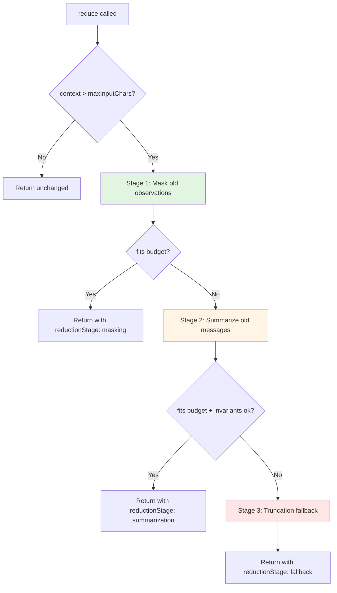
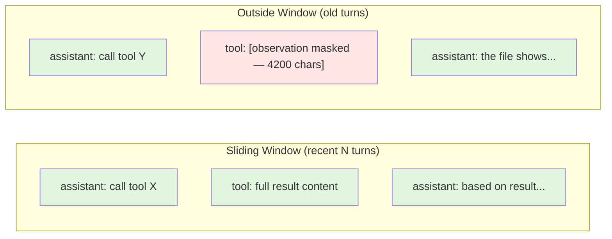

# Design Document: Observation Masking (Sliding Window)

## Overview

Refactor the `HistoryReducer` to implement a graduated reduction pipeline: **mask old observations first**, then summarize if needed, then fall back to truncation. The key insight from JetBrains Research is that agent actions and reasoning are high-value context (decisions, plans, constraints), while tool-result observations are low-value once consumed (file contents, command output, search results). By selectively masking observations outside the sliding window while preserving all agent turns, context cost drops ~50% with no quality loss.

## Steering Document Alignment

### Technical Standards (tech.md)
- Extends the existing `HistoryReducer` class in `src/core/llm/history-reducer.ts`
- Pure TypeScript, no new dependencies
- Follows existing pattern: stateless functions operating on `ChatMessage[]` arrays
- Tests colocated as `history-reducer.test.ts` (existing file extended)

### Project Structure (structure.md)
- All changes within `src/core/llm/` — no new files needed
- Extends existing `types.ts` interface with optional fields (backward compatible)
- Existing test file extended with new test cases

## Code Reuse Analysis

### Existing Components to Leverage
- **`HistoryReducer`** (`src/core/llm/history-reducer.ts`): Extend with masking stage before summarization
- **`collectPairGroups()`** / **`includePairMates()`**: Reuse for pair-invariant enforcement post-masking
- **`hasPairInvariantViolation()`**: Reuse as safety check after masking
- **`buildSummary()`**: Reuse unchanged for the summarization stage
- **`truncationFallback()`**: Reuse unchanged as final fallback
- **`clipText()`**: Reuse for truncating observations to `maxObservationChars`

### Integration Points
- **`HistoryReducerOptions`** in `types.ts`: Add optional masking configuration fields
- **`HistoryReductionResult`** in `history-reducer.ts`: Extend with masking telemetry fields
- **`ChatRuntimeOptions`** in `types.ts`: No change needed (passes through `HistoryReducerOptions`)
- **Dispatch runtime** (`src/tools/workflow/dispatch-runtime.ts`): Consumer of history reduction — benefits automatically from better reduction

## Architecture

### Graduated Reduction Pipeline

The reducer applies three stages in order, stopping as soon as context fits within budget:



### Observation Masking Detail



**Key principle**: Agent messages (`role === 'assistant'`) and user messages (`role === 'user'`) are never masked. Only `pairRole === 'result'` messages outside the window get masked.

## Components and Interfaces

### Component 1: Observation Masker (internal function)

- **Purpose:** Mask old tool-result observations while preserving message structure
- **Interface:**
  ```typescript
  function maskObservations(
      messages: ChatMessage[],
      keepIndices: Set<number>,
      options: { maxObservationChars: number }
  ): { messages: ChatMessage[]; maskedCount: number; maskedChars: number }
  ```
- **Dependencies:** None (pure function)
- **Behavior:**
  - For each message NOT in `keepIndices`:
    - If `pairRole === 'result'`: replace content with placeholder, preserving metadata
    - If dispatch result (contains `BEGIN_DISPATCH_RESULT`): preserve structured JSON block, mask surrounding output
    - All other messages: leave unchanged (agent actions, user messages preserved)
  - Returns new array (no mutation)

### Component 2: Dispatch Result Detector (internal function)

- **Purpose:** Identify and extract structured blocks from dispatch results
- **Interface:**
  ```typescript
  function maskDispatchObservation(
      content: string,
      maxChars: number
  ): { masked: string; maskedChars: number }
  ```
- **Dependencies:** None (pure function)
- **Behavior:**
  - Searches for `BEGIN_DISPATCH_RESULT` / `END_DISPATCH_RESULT` delimiters
  - If found: keeps the structured block, replaces everything outside with placeholder
  - If not found: applies standard masking (full replacement)

### Component 3: Extended HistoryReducer.reduce() (modified method)

- **Purpose:** Orchestrate the graduated reduction pipeline
- **Interface:** Same signature, extended options and result
  ```typescript
  reduce(messages: ChatMessage[], options: HistoryReducerOptions): HistoryReductionResult
  ```
- **Dependencies:** `maskObservations`, `maskDispatchObservation`, existing `buildSummary`, `truncationFallback`
- **Behavior:**
  1. Early return if disabled or within budget (unchanged)
  2. Compute `keepIndices` from sliding window + system messages
  3. **Stage 1**: Call `maskObservations()` — if result fits budget, return
  4. **Stage 2**: Apply existing `buildSummary()` on non-kept, non-system messages from masked result — if fits, return
  5. **Stage 3**: Call existing `truncationFallback()`
  6. Pair invariant check after each stage

## Data Models

### Extended HistoryReducerOptions
```typescript
interface HistoryReducerOptions {
    enabled?: boolean;
    maxInputChars: number;
    preserveRecentRawTurns?: number;    // existing, default 4
    summaryMaxChars?: number;           // existing, default 1400
    observationMasking?: boolean;       // NEW — default true when enabled
    maxObservationChars?: number;       // NEW — default 80
}
```

### Extended HistoryReductionResult
```typescript
interface HistoryReductionResult {
    messages: ChatMessage[];
    reduced: boolean;
    droppedCount: number;
    invariantStatus: 'ok' | 'fallback';
    maskedCount?: number;               // NEW — observations masked
    maskedChars?: number;               // NEW — total chars removed
    reductionStage?: 'masking' | 'summarization' | 'fallback';  // NEW
}
```

### Masking Placeholder Format
```
[observation masked — {originalLength} chars]
```
For dispatch results:
```
[dispatch output masked — {maskedLength} chars]
BEGIN_DISPATCH_RESULT
{...structured JSON preserved...}
END_DISPATCH_RESULT
```

## Error Handling

### Error Scenarios

1. **Pair invariant violation after masking**
   - **Handling:** Skip to summarization stage; if still violated, fall to truncation fallback
   - **User Impact:** None — fallback is invisible, just less efficient

2. **Masking increases size (impossible by design, defensive check)**
   - **Handling:** Assert maskedChars >= 0; if negative, skip masking stage
   - **User Impact:** None — proceeds to summarization

3. **No maskable observations (all results within window)**
   - **Handling:** Masking stage is a no-op (maskedCount=0), proceed to summarization
   - **User Impact:** None — behaves like current reducer

## Testing Strategy

### Unit Testing
- **Masking stage isolation**: Verify only `pairRole === 'result'` messages outside window are masked
- **Agent message preservation**: Verify `role === 'assistant'` messages are never masked regardless of position
- **Dispatch result preservation**: Verify structured JSON blocks survive masking while surrounding prose is removed
- **Graduated pipeline**: Verify masking-only when sufficient, summarization when masking insufficient, fallback when both insufficient
- **Pair invariants**: Verify masked messages retain `pairId`/`pairRole`/`toolCallId` metadata
- **Telemetry**: Verify `maskedCount`, `maskedChars`, `reductionStage` are populated correctly
- **Backward compatibility**: Verify `observationMasking: false` produces identical behavior to current reducer
- **Default behavior**: Verify masking is on by default when `enabled: true`

### Integration Testing
- **End-to-end pipeline**: Feed realistic conversation with many tool results, verify context reduction ratio
- **Budget edge cases**: Verify behavior at exact budget boundary (masking just barely sufficient/insufficient)

## File Changes

### Modified Files
- `src/core/llm/history-reducer.ts` — Add masking stage to `reduce()`, add internal masking functions
- `src/core/llm/types.ts` — Extend `HistoryReducerOptions` and `HistoryReductionResult` with new optional fields
- `src/core/llm/history-reducer.test.ts` — Add test cases for masking, dispatch detection, graduated pipeline, telemetry

### No New Files
All changes are extensions to existing modules. No new files needed.
