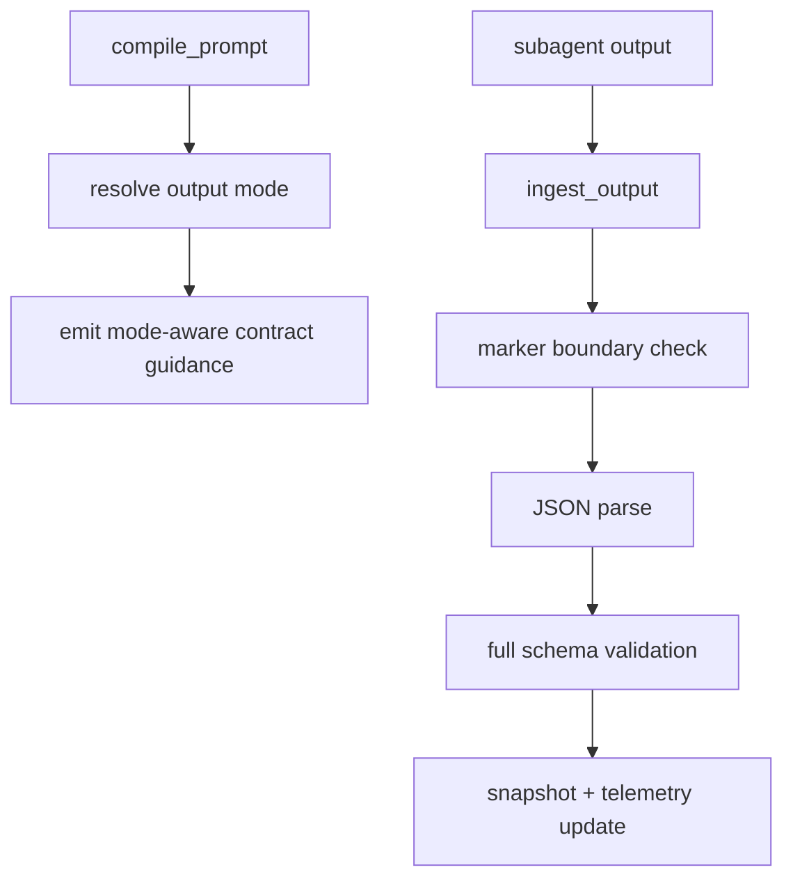

# Design Document: Dispatch Structured Output Tightening (Dimension 3 P0)

## Overview

This design upgrades dispatch structured-output handling from "prompt instructions + post-parse validation" to a capability-aware pipeline with explicit schema artifacts and deterministic mode fallback.

Current baseline is strong (strict markers + runtime validation). The gap is decode-time constraints and provider heterogeneity.

## Current State

### Already Implemented

- Strict marker contract enforcement in dispatch runtime (`BEGIN_DISPATCH_RESULT ... END_DISPATCH_RESULT`)
- Runtime schema checks via `SchemaRegistry` and typed validators
- Retry-on-schema-invalid policy
- Guide text requiring no prose outside contract block

### Missing

- Canonical JSON schema artifacts (currently validators are function-based)
- Decode-time compatibility profile (`decode_safe`)
- Provider capability map for structured-output mode selection
- Telemetry dimension for output mode and error category

## Design Goals

1. Keep ingest-time validation as authoritative safety gate.
2. Add decode-time constraints when providers support them.
3. Preserve compatibility with providers lacking constrained decoding.
4. Make behavior observable and testable per mode.

## Proposed Architecture

### Component 1: Dispatch Contract Schema Module

**New file:** `src/tools/workflow/dispatch-contract-schemas.ts`

Exports:
- Canonical schemas for implementer/reviewer result (`v1`)
- `decode_safe` schema variants (subset of features safe for broad constrained-decoding support)
- Type guards or validator adapters derived from canonical schemas

Rationale:
- Keeps schema source-of-truth centralized
- Enables both decode-time and ingest-time usage

### Component 2: Output Mode Capability Resolver

**New file:** `src/tools/workflow/dispatch-output-mode.ts`

Defines:
- `DispatchOutputMode = 'schema_constrained' | 'json_mode' | 'contract_only'`
- Provider capability map with feature flags
- Resolver `resolveDispatchOutputMode(provider, role, envOverrides)`

Behavior:
- Choose highest supported mode deterministically
- Provide mode metadata for prompt/tool telemetry

### Component 3: Runtime Validation Integration

**Modify:** `src/tools/workflow/dispatch-runtime.ts`

- Register canonical schema validators from contract schema module
- Add structured error categorization on ingest:
  - marker failures
  - JSON parse failures
  - schema mismatches
- Include output mode + schema version metadata in telemetry payloads

### Component 4: Prompt/Guide Tightening by Mode

**Modify:**
- `src/tools/workflow/get-implementer-guide.ts`
- `src/tools/workflow/get-reviewer-guide.ts`
- `src/prompts/implement-task.ts`

Behavior:
- Always keep marker/no-prose hard rules
- Add mode-aware guidance snippets:
  - `schema_constrained`: include schema ID/version and strict compliance language
  - `json_mode`: stress plain JSON object only
  - `contract_only`: strongest explicit marker + schema checklist reminder

### Component 5: Telemetry Extensions

**Modify:** `dispatch-runtime` telemetry structure

Add fields:
- `output_mode_counts` (by mode)
- `schema_error_counts` (marker_missing/json_parse_failed/schema_invalid/mode_unsupported)
- `schema_version_counts`

## Data Flow

## Validation Strategy

### Decode-Time
- Use `decode_safe` profile only when mode supports constrained decoding.
- If unsupported, degrade to `json_mode` or `contract_only`.

### Ingest-Time
- Always validate against `full` canonical schema.
- Never trust decode-time mode alone.

## Error Handling

- `marker_missing`: invalid contract boundary
- `json_parse_failed`: non-JSON payload inside markers
- `schema_invalid`: parsed object fails canonical schema
- `mode_unsupported`: requested mode not supported by provider capabilities

Each error path feeds retry policy and telemetry categories.

## Testing Strategy

### Unit

- `dispatch-contract-schemas.test.ts`
  - canonical and decode_safe schema consistency
- `dispatch-output-mode.test.ts`
  - deterministic fallback and override behavior

### Runtime

- Extend `dispatch-runtime.test.ts`
  - categorized error mapping
  - retry behavior unchanged
  - telemetry mode/error counters

### Integration

- Extend `dispatch-runtime.integration.test.ts`
  - end-to-end ingest in each mode
  - verify strict rejection of prose outside markers

## File Changes

### New

- `src/tools/workflow/dispatch-contract-schemas.ts`
- `src/tools/workflow/dispatch-contract-schemas.test.ts`
- `src/tools/workflow/dispatch-output-mode.ts`
- `src/tools/workflow/dispatch-output-mode.test.ts`

### Modified

- `src/tools/workflow/dispatch-runtime.ts`
- `src/tools/workflow/dispatch-runtime.test.ts`
- `src/tools/workflow/dispatch-runtime.integration.test.ts`
- `src/tools/workflow/get-implementer-guide.ts`
- `src/tools/workflow/get-reviewer-guide.ts`
- `src/prompts/implement-task.ts`

## Rollout

1. Add schema artifacts + mode resolver in shadow mode (telemetry only).
2. Enable mode-aware guidance and telemetry counters.
3. Enable provider capability overrides and enforce mode selection in production.

## Risks and Mitigations

- **Risk:** provider capability drift breaks constrained mode.
  - **Mitigation:** deterministic fallback to lower mode + telemetry alerts.
- **Risk:** decode_safe schema too permissive.
  - **Mitigation:** full ingest-time schema always authoritative.
- **Risk:** complexity creep in guides/prompts.
  - **Mitigation:** central mode resolver and reusable guidance templates.
