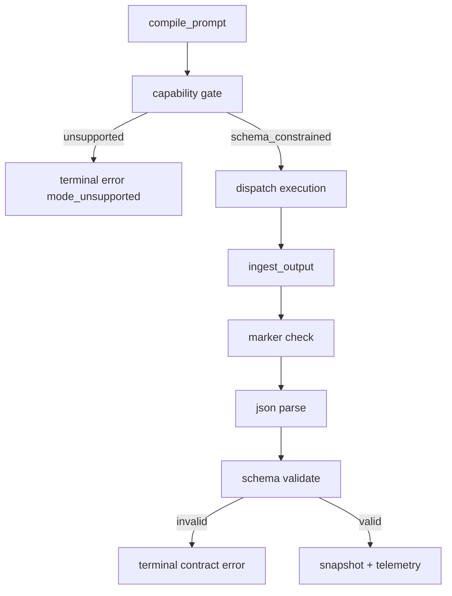

# Design Document: Dispatch Structured Output Tightening (Dimension 3 P0)

## Overview

This design enforces strict schema-constrained output for dispatch subagents with fail-fast behavior.

Principle alignment:
- **No Defensive Garbage**: no fallback output modes, no degraded parsing paths, no silent recovery.
- **Make Invalid States Unrepresentable**: output mode is a strict union with one valid operational state (`schema_constrained`) and explicit terminal error state (`unsupported`).
- **SRP/KISS**: isolate schema artifacts, capability checks, and runtime enforcement into focused modules.

## Current State

### Already Implemented

- Strict marker envelope checks in dispatch runtime
- Runtime validation via `SchemaRegistry`
- Guide text requiring no prose outside contract block

### Gaps

- No canonical schema artifact module (currently ad-hoc validators)
- No explicit provider capability gate for schema-constrained support
- Runtime still has defensive retry handling for malformed outputs

## Design Goals

1. Enforce schema-constrained output or fail before dispatch.
2. Use canonical schema artifacts as the single source of truth.
3. Keep runtime enforcement deterministic and terminal on contract violations.
4. Expose strict failure categories in telemetry.

## Proposed Architecture

### Component 1: Canonical Contract Schemas

**New file:** `src/tools/workflow/dispatch-contract-schemas.ts`

Responsibilities:
- Define canonical `v1` schema objects for implementer/reviewer outputs
- Export validators derived from these schemas
- Expose schema IDs/versions for runtime and telemetry

No alternate relaxed schema profile is introduced in this strict spec.

### Component 2: Provider Capability Gate

**New file:** `src/tools/workflow/dispatch-output-mode.ts`

Responsibilities:
- Resolve provider capability for schema-constrained output
- Return either:
  - `schema_constrained` (allowed)
  - `unsupported` (terminal)
- Reject unknown providers by default

No fallback ladder (`json_mode`/`contract_only`) is allowed.

### Component 3: Runtime Enforcement

**Modify:** `src/tools/workflow/dispatch-runtime.ts`

- Register schema validators from canonical schema module
- Categorize contract failures deterministically:
  - `marker_missing`
  - `json_parse_failed`
  - `schema_invalid`
- Remove defensive schema-invalid retry loop from runtime path
- Treat contract violations as terminal for that dispatch attempt

### Component 4: Prompt/Guide Contract Consistency

**Modify:**
- `src/tools/workflow/get-implementer-guide.ts`
- `src/tools/workflow/get-reviewer-guide.ts`
- `src/prompts/implement-task.ts`

Responsibilities:
- Keep strict no-prose + marker rules
- Reference schema version/ID used by runtime
- Avoid ambiguous language like “if possible” or “fallback”

### Component 5: Telemetry

**Modify:** `dispatch-runtime` telemetry

Add:
- schema version counts
- capability gate decisions (`schema_constrained`, `unsupported`)
- categorized terminal contract failures

No degraded/fallback-mode metrics exist in this design.

## Data Flow

## Error Handling

- `mode_unsupported`: provider fails capability gate pre-dispatch
- `marker_missing`: envelope invalid
- `json_parse_failed`: JSON body invalid
- `schema_invalid`: parsed payload violates canonical schema

All are fail-fast for the dispatch attempt. No auto-retry loop in runtime.

## Testing Strategy

### Unit Tests

- `dispatch-contract-schemas.test.ts`
  - schema validity and field coverage
- `dispatch-output-mode.test.ts`
  - capability gate allow/deny behavior

### Runtime Tests

- Extend `dispatch-runtime.test.ts`
  - terminal failure on each contract error category
  - no retry-on-invalid behavior

### Integration Tests

- Extend `dispatch-runtime.integration.test.ts`
  - unsupported provider blocked before execution
  - valid provider + valid output succeeds
  - invalid output categories fail terminally

## File Changes

### New

- `src/tools/workflow/dispatch-contract-schemas.ts`
- `src/tools/workflow/dispatch-contract-schemas.test.ts`
- `src/tools/workflow/dispatch-output-mode.ts`
- `src/tools/workflow/dispatch-output-mode.test.ts`

### Modified

- `src/tools/workflow/dispatch-runtime.ts`
- `src/tools/workflow/dispatch-runtime.test.ts`
- `src/tools/workflow/dispatch-runtime.integration.test.ts`
- `src/tools/workflow/get-implementer-guide.ts`
- `src/tools/workflow/get-reviewer-guide.ts`
- `src/prompts/implement-task.ts`

## Risks and Mitigations

- **Risk:** stricter enforcement increases hard failures initially.
  - **Mitigation:** clear typed errors + schema-aligned guide examples.
- **Risk:** provider capability metadata drifts.
  - **Mitigation:** explicit allowlist and test coverage; unknown defaults to unsupported.
