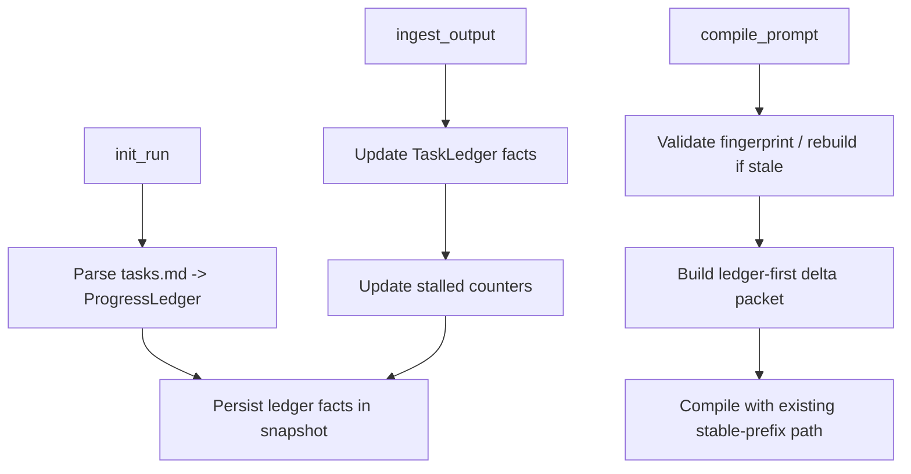

# Design Document: Dispatch Task + Progress Ledgers (Dimension 2 P1)

## Overview

This design adds a ledger layer to dispatch orchestration, following the Magentic-One pattern:
- **Task Ledger:** compact facts/decisions/plan state for the active run/task
- **Progress Ledger:** compact status state extracted from `tasks.md`

The runtime already stores `StateSnapshotFact` and parses task status markers. This design formalizes those into explicit ledgers consumed by `compile_prompt`.

## Current State

### Reusable Existing Components

- `dispatch-runtime` (`src/tools/workflow/dispatch-runtime.ts`)
  - already captures implementer/reviewer outcomes into snapshot facts
  - already compiles prompts with delta packet
- Task parser (`src/core/workflow/task-parser.ts`)
  - parses task IDs, statuses, prompts, metadata
- Snapshot state model (`src/core/llm/types.ts`)
  - provides `StateSnapshotFact` and revisioned snapshots

### Gap

- Progress/task state is implicit and spread across ad-hoc fact keys
- `compile_prompt` has no explicit ledger abstraction
- No source invalidation model for `tasks.md`-derived state
- No deterministic stalled-loop detection policy

## Steering Alignment

- Keep runtime state deterministic and test-driven
- Prefer focused context packets over full document replay
- Preserve existing API contracts and fallback behavior

## Proposed Architecture

### Component 1: Dispatch Ledger Store (new module)

**Location:** `src/tools/workflow/dispatch-ledger.ts` (new)

**Responsibilities:**
- Build/update `ProgressLedger` from `tasks.md`
- Build/update `TaskLedger` from snapshot facts + latest dispatch outcomes
- Serialize ledger summaries into compact compile-ready packets
- Validate/invalidate ledger on source changes

**Interfaces (proposed):**

```ts
interface ProgressLedger {
  specName: string;
  taskId: string;
  sourcePath: string;
  sourceFingerprint: { mtimeMs: number; hash: string };
  totals: { total: number; completed: number; inProgress: number; pending: number };
  activeTaskId: string | null;
  currentTask?: {
    id: string;
    description: string;
    status: 'pending' | 'in-progress' | 'completed';
    prompt?: string;
    requirements?: string[];
  };
}

interface TaskLedger {
  runId: string;
  taskId: string;
  planVersion: number;
  summary?: string;
  reviewerAssessment?: 'approved' | 'needs_changes' | 'blocked';
  reviewerIssues?: Array<{ severity: string; message: string; file?: string }>;
  blockers: string[];
  requiredFixes: string[];
  stalled: { consecutiveNonProgress: number; threshold: number; flagged: boolean };
}
```

### Component 2: Snapshot Fact Key Convention

Define namespaced keys to avoid ad-hoc growth:
- `ledger.task.summary`
- `ledger.task.reviewer_assessment`
- `ledger.task.required_fixes`
- `ledger.task.blockers`
- `ledger.task.stalled_count`
- `ledger.progress.active_task_id`
- `ledger.progress.totals`
- `ledger.progress.source_fingerprint`

These keys are persisted through existing snapshot merge flow.

### Component 3: Ledger-First Compile Context

`DispatchRuntimeManager.compilePrompt()` flow:
1. Load snapshot + validate progress ledger fingerprint
2. Rebuild progress ledger only if fingerprint changed or missing
3. Build compact `deltaPacket` from task ledger + progress ledger
4. Compile prompt using existing prefix stability and compaction pipeline
5. Emit telemetry with ledger mode and fallback reason (if any)

### Component 4: Stalled Progress Detector

Policy:
- increment counter when result is `blocked` or `failed` (implementer) or `blocked` assessment (reviewer)
- reset on successful forward progress (`completed` implementer, `approved` reviewer)
- flag stalled when counter reaches threshold (default: 2)
- write replan hint fact to task ledger when flagged

## Data Flow



## Error Handling

1. `tasks.md` missing at init
- return typed error code: `progress_ledger_missing_tasks`
- no silent fallback

2. parse failure/corruption
- return `progress_ledger_parse_failed`
- include file path + parse hint

3. fingerprint mismatch with read failure
- compile in degraded mode using existing snapshot facts only
- emit telemetry `ledger_plus_fallback` with reason `rebuild_failed`

4. unknown ledger keys in snapshot
- ignore unknown keys; use known-key extraction only

## Testing Strategy

### Unit Tests

- `dispatch-ledger.test.ts` (new)
  - parse tasks -> progress ledger mapping
  - fingerprint invalidation behavior
  - stalled detection state machine
  - key serialization/deserialization

### Runtime Tests

- Extend `dispatch-runtime.test.ts`
  - `compile_prompt` builds delta from ledger facts
  - fallback mode when ledger missing required fields
  - stalled counter increments/resets

### Integration Tests

- Extend `dispatch-runtime.integration.test.ts`
  - init -> compile -> ingest loops update ledgers and telemetry
  - task status changes in `tasks.md` trigger rebuild/invalidation

## File Changes

### New

- `src/tools/workflow/dispatch-ledger.ts`
- `src/tools/workflow/dispatch-ledger.test.ts`

### Modified

- `src/tools/workflow/dispatch-runtime.ts`
- `src/tools/workflow/dispatch-runtime.test.ts`
- `src/tools/workflow/dispatch-runtime.integration.test.ts`
- `src/core/llm/types.ts` (only if new typed payload fields are needed)

## Rollout

- Phase 1: ledger module + unit tests + shadow telemetry (no behavior switch)
- Phase 2: enable ledger-first compile path with fallback
- Phase 3: enable stalled replan hints and enforce thresholds

## Risks and Mitigations

- **Risk:** over-compression drops critical task constraints
  - **Mitigation:** targeted fallback injection + regression tests on required fields
- **Risk:** stale ledger after manual spec edits
  - **Mitigation:** fingerprint invalidation + rebuild on compile
- **Risk:** prompt contract drift
  - **Mitigation:** reuse existing prompt compiler and P0 prefix tests unchanged
