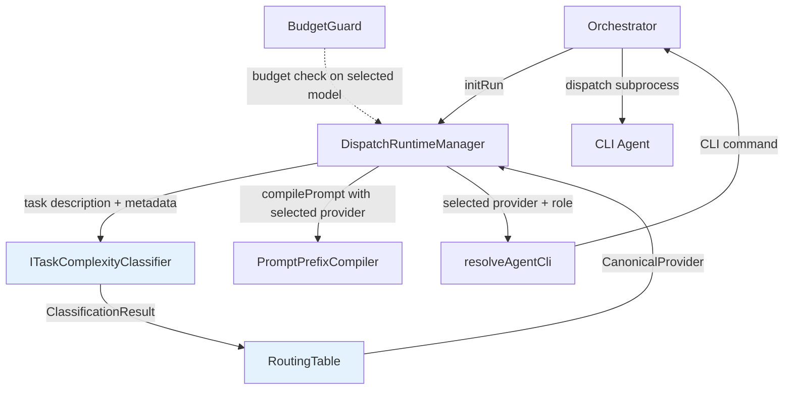

# Design: Task-Complexity Classifier for CLI Agent Routing

## Overview

A proactive task-complexity classifier that evaluates dispatch tasks and routes them to the cheapest capable CLI agent. It sits between the orchestrator's `initRun` and the actual CLI dispatch, selecting the optimal provider from `PROVIDER_CATALOG` based on task features. The classifier is a pure, synchronous function behind a strategy interface — no LLM calls, no I/O.

## Steering Document Alignment

### Technical Standards (tech.md)
- TypeScript, async-compatible interfaces (though classification itself is sync/pure)
- Strategy pattern for swappable classifier implementations
- Integration with existing `BudgetGuard` and `PROVIDER_CATALOG` infrastructure

### Project Structure (structure.md)
- New files under `src/core/routing/` — separate from `src/core/llm/` since routing is a distinct concern
- Types co-located with implementation in `src/core/routing/types.ts`
- Tests as sibling `.test.ts` files

## Code Reuse Analysis

### Existing Components to Leverage
- **`PROVIDER_CATALOG`** (`src/config/discipline.ts`): Maps canonical providers to CLI commands per role. The routing table maps complexity tiers to entries in this catalog.
- **`resolveAgentCli()`** (`src/config/discipline.ts`): Resolves provider name to CLI command. Router calls this with the selected provider.
- **`BudgetGuard`** (`src/core/llm/budget-guard.ts`): Reactive budget enforcement. Runs *after* the classifier selects a provider — if budget denies the selection, the router escalates.
- **`DispatchRuntimeManager.initRun()`** (`src/tools/workflow/dispatch-runtime.ts`): The integration point. Classification happens during or immediately after `initRun`, before `compilePrompt`.
- **`StateSnapshotFact`** (`src/core/llm/types.ts`): Classification result stored as facts in the runtime snapshot for observability.

### Integration Points
- **`dispatch-runtime.ts`**: `initRun` gains a classification step. The selected provider is stored in the snapshot and used by `compilePrompt` to resolve the CLI command.
- **`discipline.ts`**: Routing table configuration reads from env vars or defaults, following the same pattern as `SPEC_CONTEXT_DISCIPLINE`, `SPEC_CONTEXT_IMPLEMENTER`, etc.

## Architecture



**Flow:**
1. Orchestrator calls `initRun(runId, specName, taskId, projectPath)`
2. `initRun` reads the task's `_Prompt` field from `tasks.md` to extract task description
3. `ITaskComplexityClassifier.classify(taskInput)` returns `ClassificationResult`
4. `RoutingTable.resolve(complexityLevel, role)` returns the `CanonicalProvider`
5. Selected provider stored in snapshot facts
6. `compilePrompt` uses the selected provider when assembling the dispatch
7. Orchestrator reads the selected provider from the snapshot/response and passes it to `resolveAgentCli()` for the CLI command

## Components and Interfaces

### Component 1: ITaskComplexityClassifier (Interface)

- **Purpose:** Classify a task's complexity from its description and metadata
- **File:** `src/core/routing/types.ts`
- **Interface:**
  ```typescript
  type ComplexityLevel = 'simple' | 'moderate' | 'complex';

  interface TaskClassificationInput {
    taskDescription: string;
    fileCount?: number;
    estimatedScope?: 'single-file' | 'multi-file' | 'cross-module';
    taskId?: string;
    specName?: string;
    hints?: Record<string, string>;
  }

  interface ClassificationResult {
    level: ComplexityLevel;
    confidence: number;        // 0.0-1.0
    features: ClassificationFeature[];
    classifierId: string;      // which strategy produced this
  }

  interface ClassificationFeature {
    name: string;
    value: string | number | boolean;
    weight: number;            // contribution to final score
  }

  interface ITaskComplexityClassifier {
    classify(input: TaskClassificationInput): ClassificationResult;
  }
  ```
- **Dependencies:** None (pure interface)

### Component 2: HeuristicComplexityClassifier (Initial Implementation)

- **Purpose:** Rule-based classifier using keyword/pattern matching on task description
- **File:** `src/core/routing/heuristic-classifier.ts`
- **Heuristic signals (scored and weighted):**

  | Feature | Signal for `simple` | Signal for `complex` |
  |---------|---------------------|---------------------|
  | Keyword match | "test stub", "rename", "doc update", "fix typo", "move file", "update import" | "refactor", "architect", "redesign", "new interface", "cross-module" |
  | File count hint | 1 file | 3+ files |
  | Scope hint | `single-file` | `cross-module` |
  | Description length | <100 chars | >500 chars |
  | Action verb | "add", "fix", "move", "rename", "update" | "implement", "design", "refactor", "integrate" |

- **Scoring:** Each feature contributes a weighted score. Thresholds map aggregate score to `ComplexityLevel`. Default bias: when ambiguous, classify as `complex` (safe default — misrouting complex tasks to weak agents is worse than the reverse).
- **Dependencies:** `ITaskComplexityClassifier` interface
- **Reuses:** Nothing — self-contained pure function

### Component 3: RoutingTable

- **Purpose:** Map `ComplexityLevel` to `CanonicalProvider` per `DispatchRole`
- **File:** `src/core/routing/routing-table.ts`
- **Interface:**
  ```typescript
  interface RoutingTableConfig {
    simple: CanonicalProvider;
    moderate: CanonicalProvider;
    complex: CanonicalProvider;
  }

  interface RoutingTableEntry {
    provider: CanonicalProvider;
    cli: string;  // resolved CLI command
  }

  class RoutingTable {
    constructor(config: RoutingTableConfig);
    resolve(level: ComplexityLevel, role: DispatchRole): RoutingTableEntry;
    static fromEnvOrDefault(): RoutingTable;
  }
  ```
- **Default mapping:**
  ```
  simple   → codex    (cheapest, good for mechanical tasks)
  moderate → claude   (mid-tier, handles multi-file well)
  complex  → claude   (strongest available)
  ```
- **Configuration:** `SPEC_CONTEXT_ROUTE_SIMPLE`, `SPEC_CONTEXT_ROUTE_MODERATE`, `SPEC_CONTEXT_ROUTE_COMPLEX` env vars. Each accepts a provider name from `PROVIDER_CATALOG` or a custom command.
- **Validation:** `fromEnvOrDefault()` validates all referenced providers exist in `PROVIDER_CATALOG`. Fails loud on invalid provider name.
- **Dependencies:** `CanonicalProvider`, `DispatchRole`, `resolveAgentCli` from `discipline.ts`

### Component 4: Integration into DispatchRuntimeManager

- **Purpose:** Wire classifier + routing table into the dispatch lifecycle
- **File:** `src/tools/workflow/dispatch-runtime.ts` (modification)
- **Changes:**
  1. `DispatchRuntimeManager` constructor accepts `ITaskComplexityClassifier` and `RoutingTable` via dependency injection
  2. `initRun` extracts task description from the task's `_Prompt` field in `tasks.md`
  3. After extracting progress/task ledgers, calls `classifier.classify()` with task metadata
  4. Calls `routingTable.resolve()` to get the selected provider
  5. Stores classification result + selected provider in snapshot facts:
     ```
     { k: 'classification_level', v: 'simple', confidence: 0.85 }
     { k: 'selected_provider', v: 'codex', confidence: 1 }
     { k: 'classification_features', v: '<json>', confidence: 1 }
     ```
  6. Returns the selected provider in the `initRun` response payload so the orchestrator knows which CLI to invoke
- **BudgetGuard interaction:** BudgetGuard runs at the LLM provider level (`openrouter-chat.ts`), not at the CLI dispatch level. These are separate concerns — the classifier selects which CLI subprocess to spawn; BudgetGuard controls which LLM model that subprocess talks to internally. No direct integration needed at this layer.

## Data Models

### ClassificationResult
```typescript
{
  level: 'simple' | 'moderate' | 'complex';
  confidence: number;         // 0.0-1.0
  features: {
    name: string;             // e.g., 'keyword_match', 'file_count', 'description_length'
    value: string | number | boolean;
    weight: number;           // -1.0 to 1.0 contribution
  }[];
  classifierId: string;       // 'heuristic-v1'
}
```

### RoutingTableConfig
```typescript
{
  simple: CanonicalProvider;    // e.g., 'codex'
  moderate: CanonicalProvider;  // e.g., 'claude'
  complex: CanonicalProvider;   // e.g., 'claude'
}
```

## Error Handling

### Error Scenarios

1. **Classifier throws unexpected error**
   - **Handling:** Catch, log, default to `{ level: 'complex', confidence: 0, features: [], classifierId: 'fallback' }`
   - **User Impact:** Task routes to strongest agent — safe default, no degradation

2. **Routing table references unknown provider**
   - **Handling:** Fail loud at `RoutingTable.fromEnvOrDefault()` during startup
   - **User Impact:** Server fails to start with clear error message identifying the bad provider name

3. **Selected provider not configured for role**
   - **Handling:** `RoutingTable.resolve()` validates provider exists in `PROVIDER_CATALOG` for the given role. Falls back to next tier up.
   - **User Impact:** Task routes to stronger agent, logged as escalation

## Testing Strategy

### Unit Testing
- **HeuristicComplexityClassifier:** Test each feature extractor independently. Test threshold boundaries. Test default-to-complex bias for ambiguous inputs.
- **RoutingTable:** Test default config. Test env var override. Test validation failure on unknown provider. Test escalation on unavailable provider.
- **Integration with initRun:** Mock classifier + routing table. Verify classification result stored in snapshot facts. Verify selected provider returned in response.

### Integration Testing
- Full `initRun` → classification → routing → `compilePrompt` flow with real task descriptions from existing specs
- Verify the CLI command string matches expected provider output for each complexity level

### Test Cases for Heuristic Classifier
```
"Add test stub for UserService"           → simple   (keyword: "test stub", single action)
"Fix typo in README.md"                   → simple   (keyword: "fix typo", single file)
"Rename variable from foo to bar in utils"→ simple   (keyword: "rename", single file)
"Implement OAuth2 flow with PKCE"         → complex  (keyword: "implement", multi-concern)
"Refactor auth module to use strategy"    → complex  (keyword: "refactor", "strategy")
"Add error handling to API endpoints"     → moderate (scope ambiguous, multiple files possible)
```
